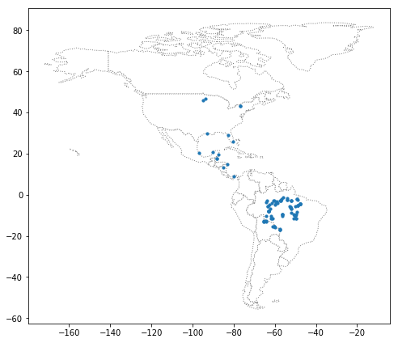
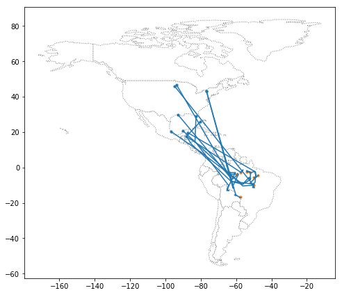
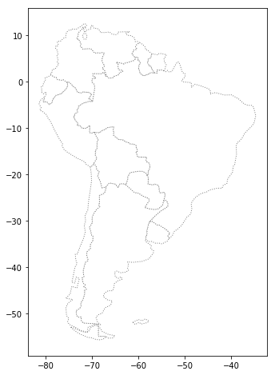
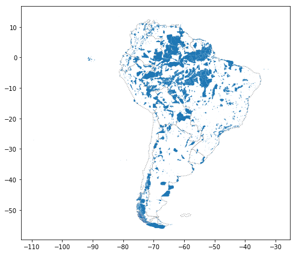

# South America Bird Migration
Geospatial analysis on purple martins migration patterns in South America

#  Introduction

This project involves analysis bird conservation and understing of migration patterns of purple martins in North/South America. In this research,  it was discovered that these birds typically spend the summer breeding season in the eastern United States, and then migrate to South America for the winter.  But since this bird is under threat of endangerment, we took a closer look at the locations that these birds are more likely to visit.

 

There are several [protected areas](https://www.iucn.org/theme/protected-areas/about) in South America, which operate under special regulations to ensure that species that migrate (or live) there have the best opportunity to thrive. Knowing the location if purple martins tend to visit these areas is a subject of my interest.  To answer this question, I use some recently collected data that tracks the year-round location of eleven different birds.

## Birds Dataset 
|   | Timestamp            | Location-Longitude | Location-Latitude | tag-local-identifier |
|---|----------------------|---------------|--------------|----------------------|
| 0 | 2014-08-15  05:56:00 | -88.146014    | 17.513049    | 30448                |
| 1 | 2014-09-01  05:59:00 | -85.243501    | 13.095782    | 30448                |
| 2 | 2014-10-30  23:58:00 | -62.906089    | -7.852436    | 30448                |
| 3 | 2014-11-15  04:59:00 | -61.776826    | -11.723898   | 30448                |
| 4 | 2014-11-30  09:59:00 | -61.241538    | -11.612237   | 30448                |

There are 11 birds in the dataset, where each bird is identified by a unique value in the "tag-local-identifier" column. Each bird has several measurements, collected at different times of the year.

### Ploting the Birds Dataset

 

## Where does each bird start and end its journey?
Now, we're ready to look more closely at each bird's path

### Starting point for each bird

|   | tag-local-identifier | Geometry(Latitude, Longitude)                |
|---|----------------------|----------------------------------------------|
| 0 | 30048                | POINT (-90.1299245 20.7324163)               |
| 1 | 30054                | POINT (-93.60860759999998 46.50563020000001) |
| 2 | 30198                | POINT (-80.3103606 25.9254455)               |
| 3 | 30263                | POINT (-76.78146219999998 42.992085)         |
| 4 | 30275                | POINT (-76.78213459999998 42.9920688)        |

### End point for each bird

|   | tag-local-identifier | Geometry(Latitude, Longitude)                 |
|---|----------------------|-----------------------------------------------|
| 0 | 30048                | POINT (-47.5363204 -4.4375763)                |
| 1 | 30054                | POINT (-62.47913810000001 -5.038396400000001) |
| 2 | 30198                | POINT (-57.4641684 -2.7761655)                |
| 3 | 30263                | POINT (-50.192297 -5.705042400000001)         |
| 4 | 30275                | POINT (-57.7040429 -16.7233589)               |

### Ploting the Birds Migration Path

 

## Where are the protected areas in South America?
It looks like all of the birds end up somewhere in South America. But are they going to protected areas?

 

|    | Population Estimation  | Continent     | Name      | ISO A3    | GDP Estimation | Geometry(Latitude, Longitude)    |
|----|-----------|---------------|--------------|--------|------------|---------------------------------------------------|
| 9  | 44293293  | South America | Argentina    | ARG    | 879400.0   | (POLYGON ((-68.63401022758323 -52.636370458874... |
| 10 | 17789267  | South America | Chile        | CHL    | 436100.0   | (POLYGON ((-68.63401022758323 -52.636370458874... |
| 20 | 2931      | South America | Falkland Is. | FLK    | 281.8      | POLYGON ((-61.2 -51.85, -60 -51.25, -59.15 -51... |
| 28 | 3360148   | South America | Uruguay      | URY    | 73250.0    | POLYGON ((-57.62513342958296 -30.2162948544542... |
| 29 | 207353391 | South America | Brazil       | BRA    | 3081000.0  | POLYGON ((-53.37366166849824 -33.7683777809007... |

### What percentage of South America is protected?
South America has 5396761.9116883585 square kilometers of protected areas.
Approximately 30.39% of South America is protected.

### Where are the birds in South America?
The following map shows the visualization of the birds migration in the South Ameircan Protected Areas

 

